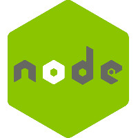

<p align="center">
  
</p>

----------------

<p align="center">
  Instagram API Clone
</p>

#### A solid foundation
<p align="center">
  NodeJs, MongoDB, Jest.
</p>

<p align="center">
    
    
    
</p>

### Purpose
This API was created to put in pratice some concepts of create a Node API using the basic concepts of `Request`,`Response` and also `Websockets`.

|         | Main Features  |
----------|-----------------
🖼️ | Create a post  `POST - /posts`
📜 | Post list `GET - /posts`
❤️ | Like `POST - /posts/id_do_post/like`

#### How to use
It's necessary to download the web client or use Postman.
You can download a web client [here](https://github.com/PeterPimentel/instagram-web-clone)

##### Requirements
- Node
- MongoDB

#### Getting Started

```bash
$ git clone https://github.com/PeterPimentel/instagram-api-clone.git
$ cd instagram-api-clone/
$ npm install
$ npm run dev
```